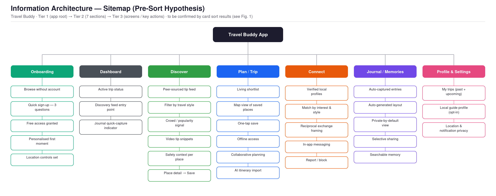

# E2E User Flow — Travel Buddy
**Project:** Travel Buddy | **Phase:** Define → Ideate  
**Linked to:** `07_Solution_Pool.md` · `06_User_Personas.md` · `05_Research_Synthesis.md` · `09_Card_Sorting_IA.md`  
**Status:** 🟢 Draft v1 — all 26 solutions mapped across 4 travel phases; IA sitemap (Section 4) is a pre-sort hypothesis pending `09_Card_Sorting_IA.md`

---

## 1. Theoretical Grounding

A user flow is "a visual representation of the path a user takes when interacting with a product, from their point of entry to the completion of a task" (Dippner, 2022, p. 168). Unlike a wireframe, which captures what a screen looks like, a user flow captures what the user *does* — the decisions they make and the states they move through. It bridges research and design by translating personas and problem statements into a testable sequence.

An end-to-end (E2E) flow extends this from a single task to the entire product lifecycle. It answers the question: *What does the full user journey look like from first contact with the product to a loyal, returning user?* For Travel Buddy, this maps directly to the four phases of the travel experience — Onboarding, Pre-Trip, In-Destination, and Post-Trip — plus a loop phase that returns the user to the start.

The happy path convention, as described by Patton (2014), shows the ideal sequence assuming no errors and a motivated user (as cited in Dippner, 2022, p. 171). This is intentional: the happy path defines the core product promise. Edge cases and error states are addressed in subsequent interaction design phases.

---

## 2. Solution Coverage Map

All 26 solutions from `07_Solution_Pool.md` are distributed across the four travel phases below. Each solution appears at the point where it would naturally be encountered in the user journey.

| Phase | Solutions covered |
|-------|-------------------|
| Onboarding | A1, A2, A3, A4, A5 |
| Pre-Trip — Discover | D1, D2, D3, D4, D5 |
| Pre-Trip — Plan | P1, P2, P3, P5, P6 |
| In-Destination — Navigate | P1 (reorder), P4 |
| In-Destination — Connect | C1, C2, C3, C4, C5 |
| In-Destination — Capture | J1 |
| Post-Trip — Journal & Share | J2, J3, J4, J5 |
| Between Trips | D1 (re-entry loop) |

---

## 3. E2E Flow Diagram

> **How to read this diagram:** Each node shows the feature description and its Solution Pool ID (·Dx / ·Px / ·Cx / ·Jx / ·Ax). Diamond shapes are decision points. Rounded rectangles are entry/exit anchors. The happy path follows the main vertical spine; branches show the most common alternate path (e.g. skipping sign-up, going offline, choosing not to share).

```mermaid
flowchart LR
    subgraph OB["🚀 Onboarding"]
        n1([User arrives]) --> n2["Browse without account · A4"]
        n2 --> n3{Ready to sign up?}
        n3 -- Yes --> n4["3-question onboarding · A5"]
        n4 --> n5["Free access granted · A1"]
        n5 --> n6["Personalised first moment · A2"]
        n6 --> n7["Set location controls · A3"]
    end

    subgraph PRE["📋 Pre-Trip — Discover & Plan"]
        n8([Enter Discovery]) --> n9["Peer-sourced tip feed · D1"]
        n9 --> n10["Filter by travel style · D2"]
        n10 --> n11["Check crowd signal · D3"]
        n11 --> n12["Watch video snippet · D4"]
        n12 --> n13["Review safety context · D5"]
        n13 --> n14["One-tap save to shortlist · P3"]
        n14 --> n15["Import AI itinerary · P6"]
        n15 --> n16["Build living shortlist · P1"]
        n16 --> n17["Collaborate with companions · P5"]
        n17 --> n18["Map view of saved places · P2"]
    end

    subgraph DEST["📍 In-Destination — Navigate & Connect"]
        n19["Reorder shortlist on the fly · P1"] --> n20{Has internet?}
        n20 -- No --> n21["Offline access · P4"]
        n20 -- Yes --> n22["Live discovery · D1–D5"]
        n21 --> n23
        n22 --> n23([Connect with local])
        n23 --> n24["Interest & style matching · C2"]
        n24 --> n25["Verify identity · C1"]
        n25 --> n26["Reciprocal exchange · C3"]
        n26 --> n27["In-app message · C4"]
        n27 --> n28["Report / block available · C5"]
        n28 --> n29["Auto-capture: location + time · J1"]
    end

    subgraph POST["📸 Post-Trip — Journal & Share"]
        n30["Auto-generated layout · J2"] --> n31["Journal private by default · J3"]
        n31 --> n32{Share?}
        n32 -- No --> n34["Contextual memory layer · J5"]
        n32 -- Yes --> n33["Selective share with contacts · J4"]
        n33 --> n34
    end

    subgraph LOOP["🔁 Between Trips"]
        n35["Browse for next destination · D1"]
    end

    %% Cross-phase connections
    n3 -- Later --> n8
    n7 --> n8
    n18 --> n19
    n29 --> n30
    n34 --> n35
    n35 --> n8
```

---

## 4. Information Architecture Sitemap

Where Section 3 shows what the user *does* over time (a flow), a sitemap shows how the product's screens are *organised and named* (Dippner, 2022, p. 112) — the two are complementary views of the same product, not duplicates of each other. The sitemap below is built by folding this flow's phases and the cross-phase connections already in the diagram above (Section 3) into a Tier 1 → Tier 2 → Tier 3 hierarchy: **Tier 1** is the app root; **Tier 2** is the seven primary sections a user would navigate between (five content pillars plus Onboarding and a Dashboard hub); **Tier 3** is the key screens or actions inside each section, each traceable back to a Solution Pool ID.

**Figure 1.** Hypothesised sitemap, pending validation. Two structural decisions are worth flagging explicitly:

- **Dashboard is a hub, not a pillar.** It doesn't correspond to any single card from the card sort (`09_Card_Sorting_IA.md`) — it's a synthesis screen that surfaces one item from each of Discover, Plan/Trip, and Journal so a returning user lands somewhere that already reflects all three, rather than a single starting pillar. Its distinct (grey) colour in Figure 1 marks it as structurally different from the five content pillars.
- **This structure is a hypothesis, and the card sort in `09_Card_Sorting_IA.md` is designed specifically to test its riskiest assumption:** that users mentally separate Discover from Plan/Trip at all. Survey data rates Trip Planning as the single highest-priority feature, and it's plausible participants sort D1–D5 and P1–P6 into one merged "Trip Planning" group instead of two — if so, this sitemap's top-level structure changes from seven sections to six, and that change should flow from the card sort's actual output, not be pre-empted here.

---

## 5. Phase-by-Phase Breakdown

### Phase 0 — Onboarding *(Solutions: A1–A5)*

**Entry point:** User discovers Travel Buddy via referral, app store, or social media.

**Happy path:**
The user can browse the Discovery feed immediately without creating an account (A4 — no-account browsing). This ensures the product delivers value before asking for anything. When ready, a lightweight three-question setup captures travel style, interests, and home city — nothing else (A5 — lightweight onboarding). Free access is granted immediately (A1 — free-first model). Within the first session, the user encounters a personalised discovery result or sees an auto-captured moment that demonstrates the product's core value (A2 — value-first onboarding). Finally, location controls are presented transparently — the user chooses exactly what is captured and when (A3 — granular location controls).

**Decision point:** If the user skips sign-up, they enter Discovery directly. Registration is only required when saving a place or initiating a connection. This reduces the first-session drop-off caused by premature account creation gates.

**Why it matters:** Survey data (n=13) shows price (7/13) and complexity (4/13) as the top adoption barriers. This phase is designed to remove both before the user has committed to anything.

---

### Phase 1 — Pre-Trip: Discover *(Solutions: D1–D5)*

**Entry point:** User has a destination in mind or is browsing for inspiration.

**Happy path:**
The user enters a peer-sourced tip feed free from ads and paid placements (D1). They filter by travel style to see recommendations from people who travel like them — relaxed, exploratory, or cultural (D2). A crowd-signal indicator flags overly commercialised or tourist-saturated spots so the user can avoid them (D3). Short video snippets show what a place actually feels like, closing the expectation gap that lets social media photos disappoint (D4). Safety context from recent travelers is surfaced per destination (D5).

**Key insight from P1:** Cross-source convergence is how real travelers build trust. D1's peer feed should surface *why* a tip is recommended (who, when, what type of traveler) so users can apply their own trust logic — not just see a rating.

---

### Phase 2 — Pre-Trip: Plan *(Solutions: P1, P2, P3, P5, P6)*

**Entry point:** User has found things they want to do and needs to organize them into a trip.

**Happy path:**
Any tip or place in the Discovery feed can be saved to the Trip Planner with one tap — no switching apps (P3 — one-tap save). If the user has drafted an itinerary in ChatGPT or Gemini, they can paste or import it directly, converting AI-generated text into a structured, editable shortlist (P6 — AI itinerary import). The shortlist is a reorderable, living document rather than a locked day-by-day schedule (P1 — living shortlist). Travel companions are invited to view and co-edit the same shortlist (P5 — collaborative planning). A map view shows all saved places visually, supporting proximity-based decisions before arrival (P2 — map view).

**Key insight from P1:** The planner is not just a personal tool — it is a shared coordination artifact. P5 is confirmed by P1 who shares her Google Sheets planner with companions for every trip.

---

### Phase 3 — In-Destination: Navigate *(Solutions: P1, P4)*

**Entry point:** User has arrived at the destination.

**Happy path:**
The shortlist can be reordered on the fly as plans shift (P1 — reorder mode). If the user loses internet — a common in-destination scenario when roaming is expensive — core planning content remains fully accessible (P4 — offline access). This includes the shortlist, map, and any saved notes.

**Decision point:** With internet available, the user can continue browsing the live Discovery feed for spontaneous additions. Without internet, they work from saved content only.

---

### Phase 4 — In-Destination: Connect *(Solutions: C1–C5)*

**Entry point:** User wants a local recommendation or genuine interaction, not a paid tour.

**Happy path:**
The user matches with a local based on declared travel interests and style (C2 — interest matching). The local's profile shows verified identity signals so the user can assess who they are before reaching out (C1 — verified identity). The platform frames the exchange as reciprocal and free — no transaction, no booking (C3 — reciprocal exchange model). The user sends a message asking for a recommendation (C4 — in-app messaging). Report and block controls are available throughout the interaction if anything feels wrong (C5 — safety controls).

**Key insight from P1:** The desire for local advice is genuine but the barrier is not distrust — it is not knowing how to find the right person. Profile completeness (interests, past feedback, clear local identity) is what closes that gap. A sparse profile will undermine willingness to connect before a message is ever sent.

---

### Phase 5 — In-Destination: Capture *(Solution: J1)*

**Entry point:** User is actively experiencing the trip.

**Happy path:**
The app auto-captures location and timestamps throughout the day in the background — no action required from the user (J1 — auto-capture). This runs passively alongside everything else and requires no interruption to the trip. The user can add a one-tap photo or note at any point, but the minimum viable capture happens automatically.

**Key insight from P1:** "I always think I'll organize my photos when I get home. I never do." J1 must work without any decision from the user. The moment it requires thought, it stops being used.

---

### Phase 6 — Post-Trip: Journal & Share *(Solutions: J2–J5)*

**Entry point:** User has returned from the trip.

**Happy path:**
Auto-captured data is compiled into a visually polished journal layout — the user does not design it (J2 — auto-generated layout). The journal is private by default; no audience, no performance pressure (J3 — private-first). The user decides whether to share. If not, the journal becomes a personal archive — searchable, organized, and tied to real place names rather than a camera roll of unnamed files (J5 — contextual memory layer). If they choose to share, they select specific contacts rather than posting publicly (J4 — selective sharing).

**Key insight from P1:** "The main value is preserving memories and making them easier to revisit rather than social sharing." J3 and J5 together create the private memory tool that P1 described wanting. J4 is the opt-in escape valve, not the default.

---

### Phase 7 — Between Trips *(Solution: D1 re-entry)*

**Entry point:** Trip is over; user is back to daily life.

**Happy path:**
The past trip journal surfaces naturally as a reference point. When the user is ready to plan again, they re-enter the Discovery feed with accumulated context — saved places from past trips, updated travel style, and a record of what worked and what didn't. The loop closes back to Phase 1, with the user now better informed than on their first visit.

---

## 6. Solution-to-Phase Index

Quick reference for tracing any solution back to its flow position.

| Solution | ID | Phase |
|----------|----|-------|
| No-account browsing | A4 | Onboarding |
| Lightweight onboarding | A5 | Onboarding |
| Free-first model | A1 | Onboarding |
| Value-first onboarding | A2 | Onboarding |
| Granular location controls | A3 | Onboarding |
| Peer-sourced tip feed | D1 | Pre-Trip: Discover · Between Trips |
| Traveler-style matching | D2 | Pre-Trip: Discover |
| Crowd / popularity signal | D3 | Pre-Trip: Discover |
| Video tip snippets | D4 | Pre-Trip: Discover |
| Safety context | D5 | Pre-Trip: Discover |
| One-tap save | P3 | Pre-Trip: Plan |
| AI itinerary import | P6 | Pre-Trip: Plan |
| Living shortlist | P1 | Pre-Trip: Plan · In-Destination: Navigate |
| Collaborative planning | P5 | Pre-Trip: Plan |
| Map view | P2 | Pre-Trip: Plan |
| Offline access | P4 | In-Destination: Navigate |
| Interest & style matching | C2 | In-Destination: Connect |
| Verified identity | C1 | In-Destination: Connect |
| Reciprocal exchange | C3 | In-Destination: Connect |
| In-app messaging | C4 | In-Destination: Connect |
| Report / block | C5 | In-Destination: Connect |
| Auto-capture | J1 | In-Destination: Capture |
| Auto-generated layout | J2 | Post-Trip: Journal |
| Private-first journal | J3 | Post-Trip: Journal |
| Selective sharing | J4 | Post-Trip: Share |
| Contextual memory layer | J5 | Post-Trip: Memory |

---

## 7. Design Tensions Surfaced by the Flow

Mapping all solutions into a single flow reveals three structural tensions that will need resolution in the Feature Strategy.

**1. Auto-capture vs. location privacy.** J1 requires background location access; A3 promises the user full control over what is captured. These two solutions are in direct tension. The design resolution must make opt-out feel safe and accessible without gutting J1's core value. A prominent, always-visible toggle is the minimum required.

**2. Onboarding length vs. personalization depth.** A5 caps onboarding at three questions, but D2 (travel style filtering) and C2 (interest matching) both depend on profile data to work well. The richer the profile, the better the product performs — but longer onboarding increases drop-off. A progressive disclosure model (capture minimum at first, prompt for more at the moment it adds value) would resolve this without compromising A5's intent.

**3. Passive capture vs. active memory.** J1 auto-captures everything; J5 surfaces memories tied to real places and context. But P1 interview data shows users also want control over the output — the ability to remove unwanted captures. An edit-before-publish model (J1 captures everything → user reviews before finalizing → J2 generates the polished layout) could balance capture completeness with user agency.

---

## 8. Next Steps

→ `09_Feature_Strategy.md` — Apply MoSCoW prioritization to the solution pool using this flow as the sequencing reference. Identify which solutions are Must Have for v1 and which can be deferred.

→ Wireframes — Use this flow as the screen-by-screen brief. Each node in the diagram corresponds to at least one screen state.

---

## References

- Dippner, D. (2022). *User Experience Design – Principles & Methods.* SRH Fernhochschule.
- Patton, J. (2014). *User Story Mapping.* O'Reilly Media. (as cited in Dippner, 2022, p. 171)
- `07_Solution_Pool.md` — source for all solution IDs and descriptions
- `06_User_Personas.md` — persona context behind each phase's design decisions
- `05_Research_Synthesis.md` — P1 interview insights cited in phase breakdowns
- `09_Card_Sorting_IA.md` — card sort designed to validate or reframe the sitemap hypothesis in Section 4
