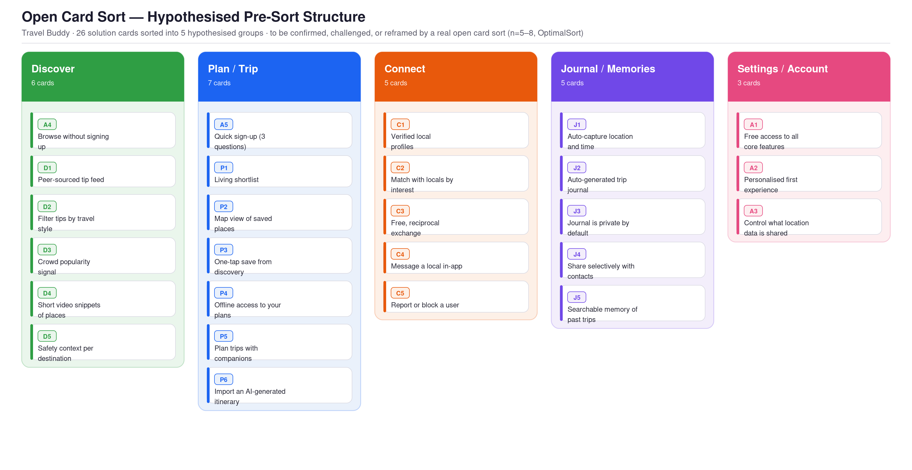

# Card Sorting & Information Architecture — Travel Buddy
**Project:** Travel Buddy | **Phase:** Define → Structure  
**Linked to:** `07_Solution_Pool.md` · `08_E2E_User_Flow.md` · `06_User_Personas.md`  
**Status:** 🟡 Ready to run | Method: Open card sort · Remote/digital · n=5–8 target

---

## 1. Theoretical Grounding

Information architecture (IA) describes how content and features are organised, labelled, and navigated within a product. A well-structured IA reduces cognitive load by matching the product's structure to users' mental models — the internal representations users already have of how information should be grouped (Dippner, 2022, p. 112).

Card sorting is the primary method for discovering those mental models empirically rather than assuming them. Participants are given a set of cards, each representing a feature or piece of content, and asked to group them in whatever way feels natural to them. In an **open card sort**, participants also name their own groups. This reveals the vocabulary and conceptual structure users bring to the product, which becomes the basis for labelling and navigation design (Spencer, 2009, as cited in Dippner, 2022, p. 118).

The output of this session feeds directly into the site map and, subsequently, the navigation structure used in wireframing. Where the E2E user flow (see `08_E2E_User_Flow.md`) answers *what happens in what order*, the IA answers *how features are named and where users expect to find them*.

---

## 2. Research Objective

> **What mental model do Travel Buddy's target users apply when grouping the product's 26 features — and what navigation structure does that imply?**

Secondary questions this session will answer:

- What labels do users naturally reach for when naming groups of travel features?
- Which features do users consistently group together vs. struggle to place?
- Are there features that don't fit neatly into any mental category (outliers)?
- Does the grouping differ between personas (Explorer vs. Social Connector vs. Documenter)?

---

## 3. Card Set — All 26 Solutions

Each card uses a plain-language feature name (no solution IDs visible to participants). IDs are listed here for cross-reference with `07_Solution_Pool.md`.

| # | Card label | Plain-language description shown to participant | Solution ID |
|---|------------|--------------------------------------------------|-------------|
| 1 | Browse without signing up | Explore the app and see tips without creating an account | A4 |
| 2 | Quick sign-up (3 questions) | Set up your profile by answering just three questions about how you travel | A5 |
| 3 | Free access to all core features | Use discovery, planning, and connection features at no cost | A1 |
| 4 | Personalised first experience | See content tailored to your travel style the first time you open the app | A2 |
| 5 | Control what location data is shared | Choose exactly when and what location information the app captures | A3 |
| 6 | Peer-sourced tip feed | Browse travel tips posted by real travelers — no ads, no paid placements | D1 |
| 7 | Filter tips by travel style | See recommendations from travelers who travel the same way you do | D2 |
| 8 | Crowd popularity signal | See how touristy or overcrowded a place has become before you visit | D3 |
| 9 | Short video snippets of places | Watch brief clips of what a destination actually looks and feels like | D4 |
| 10 | Safety context per destination | Read recent safety notes from travelers who've been there | D5 |
| 11 | Living shortlist | Build a flexible, reorderable list of places you want to visit | P1 |
| 12 | Map view of saved places | See all your saved places on a map to plan routes and proximity | P2 |
| 13 | One-tap save from discovery | Save any tip or place to your shortlist with a single tap | P3 |
| 14 | Offline access to your plans | Access your shortlist, map, and notes even without internet | P4 |
| 15 | Plan trips with companions | Invite travel companions to view and co-edit the same shortlist | P5 |
| 16 | Import an AI-generated itinerary | Paste or import a ChatGPT/Gemini itinerary and turn it into an editable shortlist | P6 |
| 17 | Verified local profiles | See verified identity signals on locals' profiles before reaching out | C1 |
| 18 | Match with locals by interest | Find locals who share your travel interests and style | C2 |
| 19 | Free, reciprocal exchange | Connect with locals for honest advice — no fees, no bookings | C3 |
| 20 | Message a local in-app | Send and receive messages with locals directly inside the app | C4 |
| 21 | Report or block a user | Report inappropriate behaviour or block someone at any time | C5 |
| 22 | Auto-capture location and time | The app quietly records where you were and when — no action needed | J1 |
| 23 | Auto-generated trip journal | Your trip is automatically turned into a visual journal from your captures | J2 |
| 24 | Journal is private by default | Your trip journal is only visible to you unless you choose to share it | J3 |
| 25 | Share selectively with contacts | Send specific parts of your journal to chosen contacts, not publicly | J4 |
| 26 | Searchable memory of past trips | Browse and search your past trips by place, date, or experience | J5 |

---

## 4. Participant Criteria

Target **5–8 participants** for an open card sort. Research shows diminishing returns beyond 15 participants for card sorting; 5–8 is sufficient to identify stable grouping patterns (Tullis & Wood, 2004, as cited in Dippner, 2022, p. 120).

### Inclusion criteria
- Taken at least one leisure trip in the past 12 months
- Uses a smartphone and at least one digital tool for travel planning
- Age 20–45 (primary Travel Buddy target range)
- Mix of travel frequencies: at least 2 participants who travel 3+ times/year and 2 who travel 1–2 times/year

### Persona distribution (aim for)
| Persona | Target n | Screener signal |
|---------|----------|-----------------|
| Explorer / Pragmatic Planner | 2–3 | "I plan carefully but adapt a lot once I'm there" |
| Social Connector | 1–2 | "Meeting locals or other travelers is the best part of a trip" |
| Documenter | 1–2 | "I always mean to organize my trip photos but never do" |

### Exclude
- People who work in UX, product design, or app development (too familiar with IA conventions)
- People who have seen or discussed Travel Buddy previously

---

## 5. Tool Setup — Remote Card Sort

**Recommended tools (in order of preference):**

| Tool | Why | Free tier |
|------|-----|-----------|
| [Optimal Workshop (OptimalSort)](https://www.optimalworkshop.com) | Purpose-built for card sorting; exports similarity matrix and dendrograms automatically | 10 responses free |
| [Maze](https://maze.design) | Integrates with Figma; good for follow-up questions | Limited free tier |
| [Miro](https://miro.com) | Flexible but requires manual analysis; good if tools above aren't available | Free |

### Setup checklist (OptimalSort recommended)

- [ ] Create a new "Open card sort" study
- [ ] Enter all 26 card labels and descriptions from Section 3 above
- [ ] Enable "Allow participants to create their own groups" (required for open sort)
- [ ] Set max session time: **20 minutes** (26 cards is a moderate load)
- [ ] Add 3 post-sort questions (see Section 6)
- [ ] Set language to English
- [ ] Generate shareable link for distribution
- [ ] Pilot test with 1 person before sending to participants

---

## 6. Session Protocol

### Pre-session instructions (shown to participant)

> "You'll see 26 cards, each describing a feature of a travel app. Your job is to sort them into groups that make sense to you — there are no right or wrong answers.
>
> Once you've sorted all the cards, give each group a name that describes what the cards in it have in common.
>
> Some cards might not fit anywhere — that's fine. You can leave them unsorted or put them in a group by themselves.
>
> This should take around 15–20 minutes."

### Post-sort questions (shown after sorting is complete)

1. **"Is there a group you found hard to name? Which one, and why?"**  
   *(Open text — reveals labelling friction)*

2. **"Were there any cards that felt like they could belong in more than one group?"**  
   *(Open text — reveals cards that sit at category boundaries)*

3. **"If this were a real app, what would you call the main sections in the navigation?"**  
   *(Open text — directly surfaces navigation label candidates)*

---

## 7. Analysis Approach

After collecting 5–8 responses, analyse the data in three passes.

### Pass 1 — Similarity matrix
Generate a similarity matrix showing how often each pair of cards was placed in the same group. Pairs with >70% co-occurrence are strong candidates for the same IA section. OptimalSort generates this automatically.

### Pass 2 — Dendrogram (hierarchical clustering)
The dendrogram visualises which cards cluster together most consistently. Cut the dendrogram at a level that produces 4–6 clusters — this becomes the candidate IA structure. Compare against the existing phase groupings in `08_E2E_User_Flow.md`.

### Pass 3 — Group label analysis
Collect all group names participants used. Look for:
- **Convergent labels** — words used by 3+ participants → strong navigation label candidates
- **Divergent labels** — same cards, very different names → labelling problem to solve in design
- **Outlier cards** — frequently left unsorted or placed alone → may need a dedicated "Other" category or a rethink of the feature's positioning

### Analysis template (fill in after sessions)

| Cluster | Cards consistently grouped together | Most common participant labels | Candidate nav label |
|---------|-------------------------------------|-------------------------------|---------------------|
| TBD | TBD | TBD | TBD |
| TBD | TBD | TBD | TBD |
| TBD | TBD | TBD | TBD |
| TBD | TBD | TBD | TBD |
| TBD | TBD | TBD | TBD |

---

## 8. Hypothesised IA Structure (pre-sort)

Before running the sort, the E2E flow suggests these natural groupings. The card sort will confirm, challenge, or reframe them. **Figure 1** visualizes all 26 cards laid out exactly as a participant would see them mid-sort in OptimalSort — five hypothesised groups, each card carrying its Solution Pool ID so the mapping stays traceable back to `07_Solution_Pool.md`.

**Figure 1.** Pre-sort hypothesis — this is the structure the real 5–8 participant open sort is designed to test, not a result. If participants group cards differently (e.g., merging Discover and Plan/Trip into one "Trip Planning" section, per the open question below), this figure gets redrawn from their actual data, not adjusted to match this hypothesis.

| Hypothesised section | Features likely to cluster here | Basis |
|---------------------|----------------------------------|-------|
| **Discover** | D1–D5, A4 (browse without account) | Phase 1 of E2E flow; all are passive browsing behaviours |
| **Plan / Trip** | P1–P6, A5 (onboarding shortcut) | Phase 2–3; all relate to organising a trip |
| **Connect** | C1–C5 | Phase 4; all involve people-to-people interaction |
| **Journal / Memories** | J1–J5 | Phase 5–6; all involve capture and reflection |
| **Settings / Account** | A1–A3 | Onboarding + privacy controls; expect users to treat these as "account" items |

**Key hypothesis to test:** Will users separate *Discover* from *Plan*, or merge them into a single "Trip Planning" section? Survey data (n=13) rated Trip Planning as the #1 feature, but the E2E flow treats Discovery and Planning as distinct phases.

---

## 9. IA Output Format

The pre-sort hypothesis version of this sitemap is already drafted in `08_E2E_User_Flow.md` (Section 4, Figure 2), structured exactly in the tiers below so the real results can be dropped in without changing the format:

- **Tier 1** — Primary navigation labels (bottom tab bar or top nav)
- **Tier 2** — Screens within each section
- **Tier 3** — Key actions or sub-views within each screen

Once the sort runs, revise `08_E2E_User_Flow.md` Section 4 directly against the similarity matrix and dendrogram (Section 7 above) rather than branching a separate sitemap file — keeping one sitemap in one place avoids the flow doc and the IA doc drifting out of sync. This sitemap feeds directly into wireframe planning.

---

## 10. Logistics Checklist

- [ ] Set up OptimalSort study with all 26 cards
- [ ] Pilot test with 1 participant (adjust card wording if confusing)
- [ ] Recruit 5–8 participants matching criteria in Section 4
- [ ] Distribute link and set a response deadline (recommend 1 week)
- [ ] Export similarity matrix and dendrogram after all responses received
- [ ] Complete analysis template in Section 7
- [ ] Write up `10_IA_Sitemap.md` based on findings

---

## References

- Dippner, D. (2022). *User Experience Design – Principles & Methods.* SRH Fernhochschule.
- Spencer, D. (2009). *Card Sorting: Designing Usable Categories.* Rosenfeld Media. (as cited in Dippner, 2022)
- Tullis, T., & Wood, L. (2004). How many users are enough for a card-sorting study? *Usability Professionals Association Conference.* (as cited in Dippner, 2022)
- `07_Solution_Pool.md` — source for all 26 solutions mapped to cards
- `08_E2E_User_Flow.md` — E2E flow used to form the hypothesised IA in Section 8
- `06_User_Personas.md` — persona distribution used for participant recruitment
